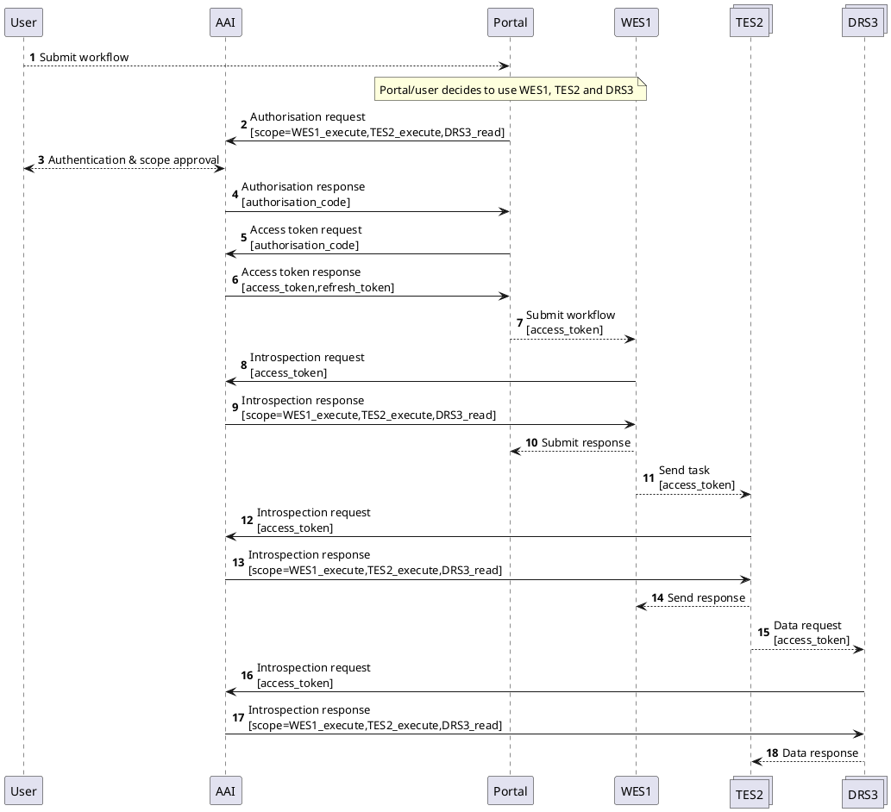
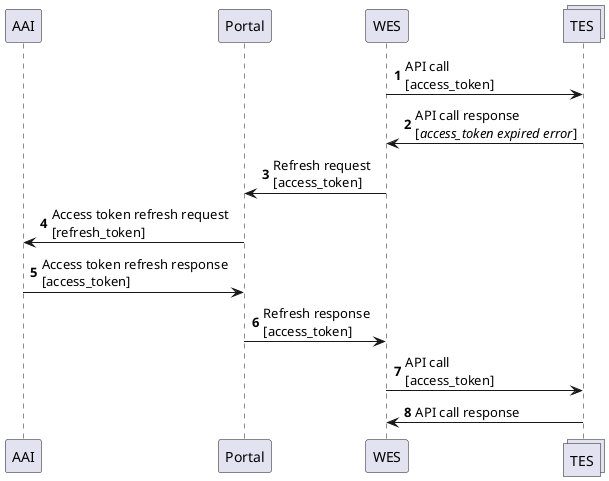
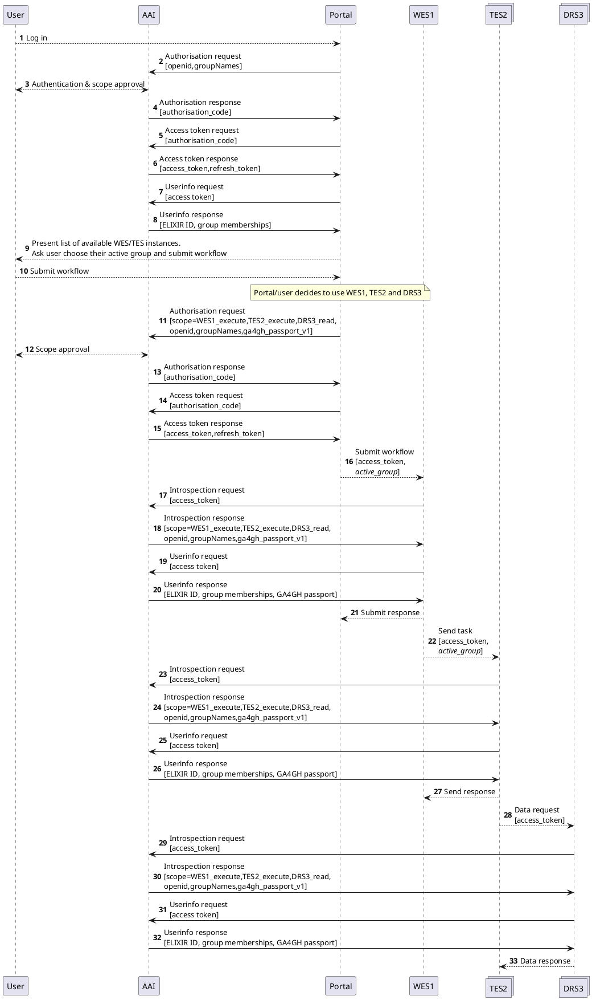

# Architecture for supporting ELIXIR AAI in GA4GH Cloud compatible interface

## Table of Contents

- [Version history](#version-history)
- [1. Background and requirements](#1-background-and-requirements)
  - [1.1. High level architecture](#11-high-level-architecture)
  - [1.2. Key requirements](#12-key-requirements)
  - [1.3. Trust assumptions](#13-trust-assumptions)
- [2. Proposed solution](#2-proposed-solution)
  - [2.1. Starting workflows or jobs and accessing files on behalf of the user](#21-starting-workflows-or-jobs-and-accessing-files-on-behalf-of-the-user)
    - [2.1.1. Regular access flow](#211-regular-access-flow)
    - [2.1.2. Refreshing an expired access token](#212-refreshing-an-expired-access-token)
    - [2.1.3. Discussion](#213-discussion)
  - [2.2. Enforcing access and resource quota](#22-enforcing-access-and-resource-quota)
    - [2.2.1. Regular OIDC flow](#221-regular-oidc-flow)
    - [2.2.2. Refreshing an expired access token](#222-refreshing-an-expired-access-token)
    - [2.2.3. How to select which ELIXIR AAI group resources to use for the computation](#223-how-to-select-which-elixir-aai-group-resources-to-use-for-the-computation)
  - [2.3. API access management](#23-api-access-management)
- [3. Conclusions](#3-conclusions)
- [Appendix 1. Flowchart source code](#appendix-1-flowchart-source-code)
  - [Message sequence chart 1](#message-sequence-chart-1)
  - [Message sequence chart 2](#message-sequence-chart-2)
  - [Message sequence chart 3](#message-sequence-chart-3)

## Version history

| Date | Editor | Change |
| --- | --- | --- |
| 6 April 2018 | Juha Törnroos | Initial draft based on [EBI’s requirements analysis][ebi-requirement-analysis] |
| 17 Dec 2018 | Mikael Linden | Added solution #2 that relies on OAuth2 |
| 28 Feb 2019 | Mikael Linden | Added message sequence charts for solution #2 and an outline for the use of token exchange flow |
| 27 Mar 2019 | Jaakko Leinonen, Mikael Linden | Added solution #3 with a single access token |
| 3 Apr 2019 | Mikael Linden | Added new sections “Trust assumptions” to articulate the requirements on trust |
| 3 Feb 2020 | Jaakko Leinonen, Mikael Linden | Removed solution #1, refined solution #3 as the proposed solution and changed solution #2 to model the OAuth2 flow; restructured document |
| 14 Feb 2020 | Jaakko Leinonen, Mikael Linden | Version 1.0 |
| 9 Mar 2020 | Alexander Kanitz | Version 1.1: converted to markdown and put in GitHub repository |
| 20 April 2020 | Vivek Raj | Version 1.2: adding OAuth2 security conventions |

## 1. Background and requirements

This document describes the technical architecture of how the user
authentication and computing resource access and accounting can be done in a
GA4GH Cloud compatible interface using ELIXIR AAI. The approach can be easily
extended to other AAIs (authentication and authorisation infrastructure) that
support OAuth2 and OpenID Connect protocols and GA4GH Passports and AAI for
expressing data access authorisation.

The GA4GH Cloud instance consists of three key components; the workflow
execution schema (WES), the task execution schema (TES) and the data repository
service (DRS). WES is responsible for splitting workflows into tasks which are
distributed to one or more TES instances. DRS provides a generic interface to
data repositories.

In October 2019 GA4GH approved the GA4GH Passport and AAI specifications which
effectively define the syntax for the access tokens and claims (dubbed as Visas)
retrievable from an OIDC provider. This architecture makes use of Passports and
Visas for describing TES’s permission to access files in DRS on behalf of the
user. Notice, that the GA4GH Passport and AAI specifications do not define
computing resource access in the GA4GH compatible cloud.

### 1.1. High level architecture

The figure below introduces the high level architecture of the system:

![High level architecture][flow-high-level]

Key functionalities are:

- [ELIXIR AAI][elixir-aai], which has an OAuth2 Authorisation server (AS) and
  OpenID Connect Provider (OIDC OP) that is able to authenticate the end users
  with their pre-registered identities, issue access tokens and deliver user’s
  claims in exchange to an access token;
- Web portal (Portal) is a system component where the end user is able to
  initiate and administer their jobs in the system. The Portal is the only
  system component exposing a web interface for the end users. The Portal is
  the client of the ELIXIR AAI AS/OP and uses standard OAuth2/OIDC means to
  ask the AS/OP to authenticate the user and deliver an access token and a
  refresh token;
- [Workflow execution schema][ga4gh-wes] (WES) implements the WES API of the
  GA4GH and is responsible for splitting workflows into tasks for their
  subsequent distribution to downstream TES services. WES API accepts the access
  token issued by the AS/OP as an API call parameter;
- [Task execution schema][ga4gh-tes] (TES) implements the TES API of GA4GH and
  is responsible for running the tasks. TES API accepts the access token issued
  by the AS/OP and mediated by the WES as an API call parameter;
- [Data repository service][ga4gh-drs] (DRS), which provides data resource
  locations for TES. DRS accepts the access tokens issued by AS/OP and mediated
  by WES and TES and potentially makes use of the GA4GH Passports and visas
  retrieved from the OP.

In this document, TES may also refer to a specific TES implementation
[TES(K)][elixir-cloud-tesk], which runs on Kubernetes. For the purposes of this
document TES and TES(Kkj) may be used interchangeably.

### 1.2. Key requirements

The implementation of user identification and authorization should consider the
following requirements and limitations. See [RFC2119][rfc2119] for the
definition of terms MUST, MUST NOT, SHOULD, and MAY.

The implementation:

- **MUST** uniquely identify the user on whose behalf an API call is made.
- **MUST NOT** allow anonymous, non-identified, or unauthorised usage of APIs.
  For any such request an error **MUST** be returned with information that
  access is denied.
- **MUST** have an authorization for each actor from the user to act on his/her
  behalf.
- **MUST** reject an expired or revoked authorisation and reject any further API
  call. Currently running actions **MAY** continue running until they finish.
- **SHOULD** use general security considerations for all client-server
  communications between actors, e.g. use TLS and access lists for known hosts.

### 1.3. Trust assumptions

The following consideration articulates the assumed trust relationships (i.e.
which actor can do what) and related mitigation measures that will be described
in the next section:

| No | Requirement | Mitigation |
| --- | --- | --- |
| 1 | WES must not be able to launch arbitrary tasks and TES must not be able to access arbitrary files in DRS on behalf of a user. Instead, _user involvement_is required, i.e., there must be a user taking active and conscious steps to authorise them. | OAuth2 is used by the user for authorising TES and DRS API calls (see [section 2.1](#21-starting-workflows-or-jobs-and-accessing-files-on-behalf-of-the-user)).
| 2 | Only _authenticated_ users can access WES, TES and DRS. | ELIXIR AAI and OIDC protocol is used for authentication at WES, TES and DRS (either directly or indirectly by virtue of an access token and a subsequent Userinfo query) (see [section 2.2](#22-enforcing-access-and-resource-quota)).
| 3 | Only _authorised_ users can launch workflows in WES, tasks in TES and access files in DRS. | WES, TES and DRS rely on the attributes provided by ELIXIR AAI for authorisation (see [section 2.2](#22-enforcing-access-and-resource-quota)).
| 4 | Only particular WES instances can launch tasks in TES and only particular TES instances can access files in DRS. A WES instance can launch tasks only in particular TESes and a TES instance can access files only in particular DRSes. | Use of client credentials (see [section 2.3](#23-api-access-management)).

## 2. Proposed solution

The proposed solution consists of the following functionalities

- the user delegates a system component the permission to call an API on behalf
  of themselves (section 2.1)
- the system components enforce access based on authenticated user’s attributes,
  such as group memberships or GA4GH Visas (section 2.2)
- the system components control which clients can call an API (section 2.3)

### 2.1. Starting workflows or jobs and accessing files on behalf of the user

An end user selects a WES they know about, or otherwise are able to trust.
However, WES is not the entity processing the data, but TESes and DRSes are.
Hence, the end user must select and authorise those TESes and DRSes they wish to
use from the list of  WES provides. WES must only provide TESes and DRSes it
trusts.

This section employs OAuth2 protocol to describe how the system makes sure the
user is sufficiently involved in delegation of their permissions to different
system components. This includes the user giving:

- a WES instance the permission to launch tasks in a TES instance on behalf of
themselves
- a TES instance the permission to access files in DRS on behalf of
themselves

#### 2.1.1. Regular access flow

The figure and message sequence chart below describe the OAuth2 interaction of
the components during a regular workflow submission, including triggering a
workflow in WES which invokes a task in TES which further needs to access a
dataset in DRS:

![OAuth2 flow][flow-oauth2]

![OAuth2 message sequence chart][msg-seq-oauth2]

**Message Sequence Chart 1. A user submits a workflow and uses OAuth2 to
authorise WES to submit a task to TES and TES to access datasets in DRS on
behalf of themselves.**

A user has a workflow (CWL), which they submit for execution (arrow 1). They
select a suitable service provider from the portal for their needs. The
user/portal decides WES1, TES2 and DRS3 will be used.

The user is redirected to ELIXIR AAI for authentication before submitting the
workflow. The portal uses regular OAuth2 Authorisation code flow to obtain an
access token from AS (arrows 2,4,5,6). After a successful authentication ELIXIR
AAI will ask the user to give their permission to the portal and the downstream
system components to initiate a workflow in WES1 (scope=WES1_execute), initiate
a task in TES2 (scope=TES2_execute) and access files in DRS3 (DRS3_read) on
behalf of themselves (arrow 3).

To initiate the workflow in WES1 the portal calls the API of WES1 and attaches
the access token to the request (arrow 7). WES1 validates the access token
(arrows 8,9) and checks that it has the scope that is needed for its API call
(scope=WES1_execute). If the access token is invalid or does not contain the
scope WES1 will reject the request. For an expired access token a refresh
process will be tried, see [section
2.1.2](#212-refreshing-an-expired-access-token). WES1 will then split the
workflow into tasks (if needed) and select suitable TES(es) for running the
tasks.

WES1 calls the APIs of the relevant TES(es) and attaches the access token to the
request(s) (arrow 11). TES2 validates the access token (arrows 12,13) and checks
that it has the scope that is needed for its API call (scope=TES2_execute). If
the access token is invalid or does not contain the scope TES2 will reject the
request. For an expired access token a refresh process will be tried, see
[section 2.1.2](#212-refreshing-an-expired-access-token). If the access token
is acceptable, TES2 initiates the job.

Should TES2 access a dataset in DRS3 to execute the task, it needs to call the
DRS3 API and attach the access token to the request (arrow 15). DRS3 then
validates the access token (arrows 16,17) and checks that it has the scope that
is needed for its API call (scope=DRS3_read). If the access token is invalid or
does not contain the scope DRS3 will reject the request. For an expired access
token a refresh process will be tried, see [section
2.1.2](#212-refreshing-an-expired-access-token).

> The [OAuth2 specification][specs-oauth2-2.1] specification requires that the
> introspection endpoint is protected properly, e.g. with client credentials.
> This may imply that also WES1, TES2 and DRS3 must be registered as clients to
> the AS.

#### 2.1.2. Refreshing an expired access token

Access tokens have a limited lifetime. When an AS issues an access token it sets
an expiration time for it, after which the token becomes invalid and must be
refreshed. At any point the user should be allowed to revoke her/his
authorisation, resulting in the termination of refreshing the access token. The
access token can also be revoked immediately.

During the task execution the access token may expire and should be refreshed
automatically without user intervention. Access tokens cannot be renewed by WES,
TES or DRS but need to be renewed by the Portal, which is the OAuth2 client that
initially received the access token from the AS. To renew an access token, the
Portal must call the AS’s token endpoint with a specific refresh-token grant
type and attach the refresh token that the AS provided in the initial token
response (arrow 6 in MSC1).

The system component that attaches an access token to an API call will learn
that the access token is expired at the latest when the API call is rejected
with a corresponding error code. If the access token is rejected by a WES API
call that the Portal has done, the Portal itself can proceed to refresh the
access token. However, if the access token is rejected by an API call carried
out by WES or TES, they need to consult the Portal to receive a fresh access
token.

> The [OAuth2 specification][specs-oauth2-10.4] does not permit the clients to
> share the refresh tokens with the downstream services.

![Token refresh message sequence chart][msg-seq-token-refresh]

**Message sequence chart 2. Portal exposes an API through which WES can request
a fresh access token.**

The message sequence chart above proposes a flow that WES can invoke when it
observes an access token it is holding is expired. The Portal would expose the
downstream WES an API to which WES can send the expired access token. Portal
would then use the corresponding refresh token to fetch a new access token from
AS and return it to WES as the response to the API call.

Furthermore, if TES observes DRS rejects a request due to an expired access
token, WES could implement an API that TES can use to request WES to fetch a
fresh access token from the portal. It is suggested that TES does not call
Portal’s API directly because the API call must be properly authorised and
because the Portal and TES do not have direct relationship. The Portal’s API
should be exposed on TLS and should employ proper access control mechanism to
ensure only authorised access token holders can call it.

#### 2.1.3. Discussion

Notice that the only interaction with the user takes place in the beginning of
the sequence, when the ELIXIR AAI AS authenticates the user and asks them to
approve the actions (represented by “scopes”) the different system components
are going to carry out on behalf of themself. There is no opportunity for later
user interaction, because WES, TES and DRS expose only APIs for system access.

The exact number of scopes (and the related scope values) requires further
planning. The intention is to provide the user sufficient granularity to choose
from when they decide which system components they feel confident to act on
behalf of themself:

- If the Portal interacts with exactly one WES, one scope value is sufficient.
  If the portal is closely integrated to WES (for instance, both managed by the
  same organisation), one can even question if any scope is needed at all.
- If WES interacts with multiple TESes managed by different organisations, it
  may make sense that each TES instance has a scope value of its own.
- If TESes interact with several DRSes, it may make sense that each of them has
  a scope value of its own. It may also be necessary to assign several scope
  values to a DRS (“I grant this TES the permission to access Foo Study but not
  Bar Study on behalf of myself”). Notice that the scopes are not used by DRS to
  enforce access to datasets (see section 2.2) but to enable a particular TES
  instance to access a user’s datasets.

> Proposed design choice: **Each WES, TES and DRS instance has (exactly) one
> scope.**
>
> Provided it has sufficient scopes, a single access token may be used by WES to
> access TES API, and by TES to access DRS API. Alternatively, there may be
> separate access tokens (with separate scopes) for calling the WES API and TES
> API but it wouldn’t have an impact on the overall security design because the
> Portal needs to hand both access tokens to WES anyway. The OAuth2
> Authorization Server asking the user to authorise just one access token with
> sufficient scopes may simplify the user experience.

### 2.2. Enforcing access and resource quota

This section employs OpenID Connect technology to describe how the system
components can make sure that the user, represented by an access token in an API
call, is authorised to launch jobs in WES and TES and access files in DRS. The
section also describes how the computing quota can be managed.

In this section it is assumed that a user’s permission to launch jobs is based
on them being a member of a particular group managed by ELIXIR AAI. The system
component enforcing access rights (such as, WES or TES) will do it based on the
group membership claim delivered by ELIXIR AAI. DRS will enforce dataset access
based on the user’s GA4GH passport.

Accounting will be done by each group having a resource quota assigned which can
then be consumed by jobs initiated by any group member. The details of the
resource quota management (such as, the resource units used) is out of scope for
this document.

This section complements the previous section 2.1 which employed OAuth2
technology to describe how the end users can delegate system components the
permission to act on behalf of themselves.

#### 2.2.1. Regular OIDC flow

The diagram below describes how the system uses regular OIDC flows to retrieve
and enforce user’s authorisation to access services. The flow is based on
passing on an access token that is used for fetching user’s attributes (often
dubbed as claims in OIDC) from ELIXIR AAI.

![OAuth2 flow][flow-oidc]

1. Portal uses regular OIDC authorisation code flow to redirect the user to
   ELIXIR AAI which authenticates the user and asks them to approve the release
   of their attributes (e.g. ELIXIR ID, group memberships, and the GA4GH Visas
   describing their permitted datasets) to the Portal and the downstream
   services. The OP delivers an access token and refresh token to the Portal.
2. Portal uses the access token to retrieve the user’s ELIXIR ID and group
   memberships from the OP’s Userinfo endpoint. The user selects which ELIXIR
   AAI group’s computing resources they are going to use for the computation
   (see [section
   2.2.3](#223-how-to-select-which-elixir-aai-group-resources-to-use-for-the-computation)).
3. The user uploads their workflow to the portal which submits it to WES. The
   Access token is attached to the API call (in the HTTP Authorization header).
4. WES calls OP’s Userinfo endpoint to check the access token is valid and
   retrieves the user’s group memberships which are used for determining which
   TESes are available for task execution.
5. WES distributes the tasks to TESes.  The Access token is attached to the API
   call (in the HTTP Authorization header).
6. TES calls OP’s Userinfo endpoint to check the access token is valid and
   retrieves the user’s group memberships which are used for accounting purposes
   i.e. to make sure the tasks don’t exceed the user’s remaining computing
   quota.
7. If necessary, TES can call external APIs (such as, DRS or htsget) to access
   the files necessary for running the task and permitted for the end user. The
   Access token is attached to the API calls (in the HTTP Authorization header).
8. DRS calls OP’s Userinfo endpoint to check the access token is valid and
   retrieves the list of user’s permitted dataset (GA4GH ControlledAccessGrants
   Visa) for the purposes of access control enforcement.

#### 2.2.2. Refreshing an expired access token

The architecture described in [section
2.1.2](#212-refreshing-an-expired-access-token) can be used for refreshing an
expired access token.

#### 2.2.3. How to select which ELIXIR AAI group resources to use for the computation

ELIXIR AAI manages — and can deliver to the Portal — the list of user’s groups
([groupNames attribute][elixir-aai-group-names]) potentially representing the
projects they are involved in. The Portal can then ask the user to select the
group they are currently active in, and that information can be used by the
downstream WES to select proper TES(es) and by TES(es) to account the consumed
resource capacity from proper project.

However, WES and TES APIs don’t have a parameter to indicate the group in the
context of which workflow or task shall be executed. Perhaps it would be
necessary to introduce a new parameter to WES API.

### 2.3. API access management

Sections 2.1 and 2.2 above do not define which client is able to call an API as
long as the client can attach a valid access token with a valid scope to the
call. It is out of scope for both the OAuth2 and OIDC protocols to control which
clients can invoke an API, including the WES, TES, and DRS API.

#### Disclaimer
The following feature supports OAuth security practices. It is possible that it 
may or may not be supported in many places of development.

If it is desirable to limit the WES, TES and DRS API calls only to particular
clients (Third-party application), and it is proposed that the APIs are configured
to require the client credentials (e.g., a shared secret or a public key) and this
particular secret work as a prerequisite for the acceptance of that credentials at
a APIs calls as well as each API has an associated access control list allowing calls
only by trusted clients.
The workflow for this client-access management looks like:
- The OAuth server associates data with the access token that binds this
  particular token to a certain client. The binding can utilize the client identity,
  but in most cases, the OAuth server utilizes key material (or data derived
  from the key material) known to the client.
- This key material must be distributed somehow. Either the key material already
  exists before the OAuth server creates the binding, or the OAuth
  server creates ephemeral keys. The way pre-existing key material is distributed
  varies among the different approaches. For example, [X.509 Certificates](https://en.wikipedia.org/wiki/X.509)
  can be used in which case the distribution happens explicitly during the enrollment
  process. Or the key material is created and distributed at the TLS layer, in which
  case it might automatically occur during the setup of a TLS connection.
- The APIs must implement the actual proof of possession check. It is
  typically done on the application level, often tied to specific material provided 
  by the transport layer (e.g., TLS). It must also ensure that the
  replay of the proof of possession is not possible.

## 3. Conclusions

Section 2 introduced different solutions to solve different problems:

- Classic OAuth2, making use of OAuth2 scopes, to allow a user to control
  delegation of their access rights to different system components;
- Standard OIDC to enable different system components to learn an authenticated
  end user’s attributes, such as group memberships, to enforce their access
  rights and make them accountable for their consumption of resources;
- Client credentials to enable proper access management of the API calls.

The three approaches can be used together; a single access token can have the
OAuth2 scopes to manage delegation of resource access and the necessary OpenID
scopes that enable the relying service to fetch user’s attributes from OP’s
userinfo endpoint. The Message sequence chart 3 below presents how these
functionalities can be merged to a single protocol flow.

![Integrated message sequence chart][msg-seq-integrated]

**Message sequence chart 3. Integrated OAuth2 and OIDC protocol flow.**

## Appendix 1. Flowchart source code

Source codes for the Message Sequence Charts using [PlantUML][plant-uml].

### Message sequence chart 1

### Message sequence chart 2

### Message sequence chart 3

[ebi-requirement-analysis]: <https://docs.google.com/document/d/1vgM78DNtxkW3KF5EO53w4tJZW6y-ADrbQ7O8BaTaUxI/edit#>
[elixir-aai]: <https://www.elixir-europe.org/services/compute/aai>
[elixir-aai-group-names]: <https://docs.google.com/document/d/1hD0lsxotLvPaML_CSydVX6rJ-zogAH2nRVl4ax4gW1o/edit#heading=h.nyljkf32aerz>
[elixir-cloud-tesk]: <https://github.com/EMBL-EBI-TSI/TESK>
[flow-high-level]: images/flow-high-level.svg
[flow-oauth2]: images/flow-oauth2.svg
[flow-oidc]: images/flow-oidc.svg
[ga4gh-drs]: <https://github.com/ga4gh/data-repository-service-schemas>
[ga4gh-wes]: <https://github.com/ga4gh/workflow-execution-service-schemas>
[ga4gh-tes]: <https://github.com/ga4gh/task-execution-schemas>
[msg-seq-integrated]: images/msg-seq-integrated.png
[msg-seq-oauth2]: images/msg-seq-oauth2.png
[msg-seq-token-refresh]: images/msg-seq-token-refresh.png
[plant-uml]: <https://plantuml.com/>
[rfc2119]: <https://www.ietf.org/rfc/rfc2119.txt>
[specs-oauth2-10.4]: <https://tools.ietf.org/html/rfc6749#section-10.4>
[specs-oauth2-2.1]: <https://tools.ietf.org/html/rfc7662#section-2.1>
